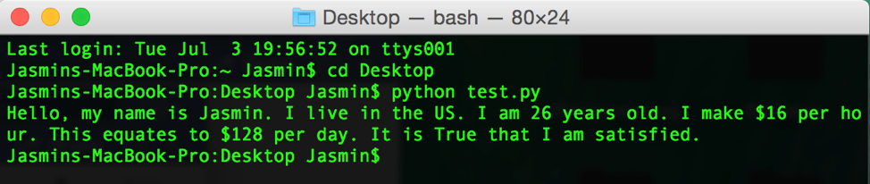

## Instructions

  * Create two variables called `name` and `country` that will hold strings.

  * Create two variables called `age` and `hourly_wage` that will hold integers.

  * Create a variable called `satisfied` which will hold a boolean.

  * Create a variable called `daily_wage` that will hold the value of `hourly_wage` multiplied by 8.

  * Print out statements using all of the above variables to the console.

## Results

## Notes
- Forgot to convert `yourXP` and `neighborXP` to `int`s. This led to the program concatenating `'3'` + `'4'` to `'34'`