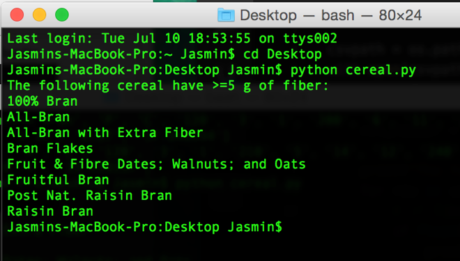

# Instructions

* Read through `cereal.csv` and find the cereals that contain five grams of fiber or more, printing the data from those rows to the terminal.

## Hint

* Everything within the csv is stored as a string and certain rows have a decimal. This means that they will have to be cast to be used.

* The csv.Reader begins reading the csv file at the first row. Explain that `next(csv_reader, None)` will skip the header row.

* Integers in Python are whole numbers and, as such, cannot contain decimals. As such, your numbers containing decimal points will have to be cast as a `float` or `double`.

## Bonus

* Try the following again but this time using `cereal_bonus.csv`, which does not include a header.

## Results

## Notes
- For bonus: simply remove csv_header = next(csvreader) since it has no header row